# Dynamic Certificate Platform — High-Level Architecture

## 1. Overview

The platform is a single, configuration-driven certificate application.

The certificate PDF is generated dynamically with **pdf-lib** after a user successfully matches the configured recipient data. The generated PDF is returned directly to the user's browser/device as a download. Generated certificate PDFs are **not permanently stored** in object storage.

It supports:

- Multiple organizations
- Multiple events per organization
- Multiple certificates per event
- CSV/XLSX recipient imports
- Dynamic certificate field mapping
- Dynamic public certificate lookup forms
- Dynamic certificate generation with `pdf-lib`
- Direct certificate downloads to the user's device
- Analytics
- Platform-wide administration
- Organization-level administration

The key architectural principle is:

> **Code defines how the platform works. Database configuration defines what each organization, event, certificate, template, and public form looks like.**

A new certificate should not require a new application or certificate-specific code.

---

## 2. Roles

There are two authenticated roles:

### SUPER_ADMIN

Platform-wide access:

- All organizations
- All organization users
- All events
- All certificates
- All recipients
- Global analytics
- Audit logs
- Platform settings

### ORG_ADMIN

Organization-level access:

- Their organization
- Organization users
- Events
- Certificates
- Recipients
- Event/certificate analytics
- Organization settings

### Public Users

Students/recipients do not need an account.

They access a public URL, submit the dynamically configured lookup form, find their certificate, and download it.

---

## 3. High-Level System Architecture

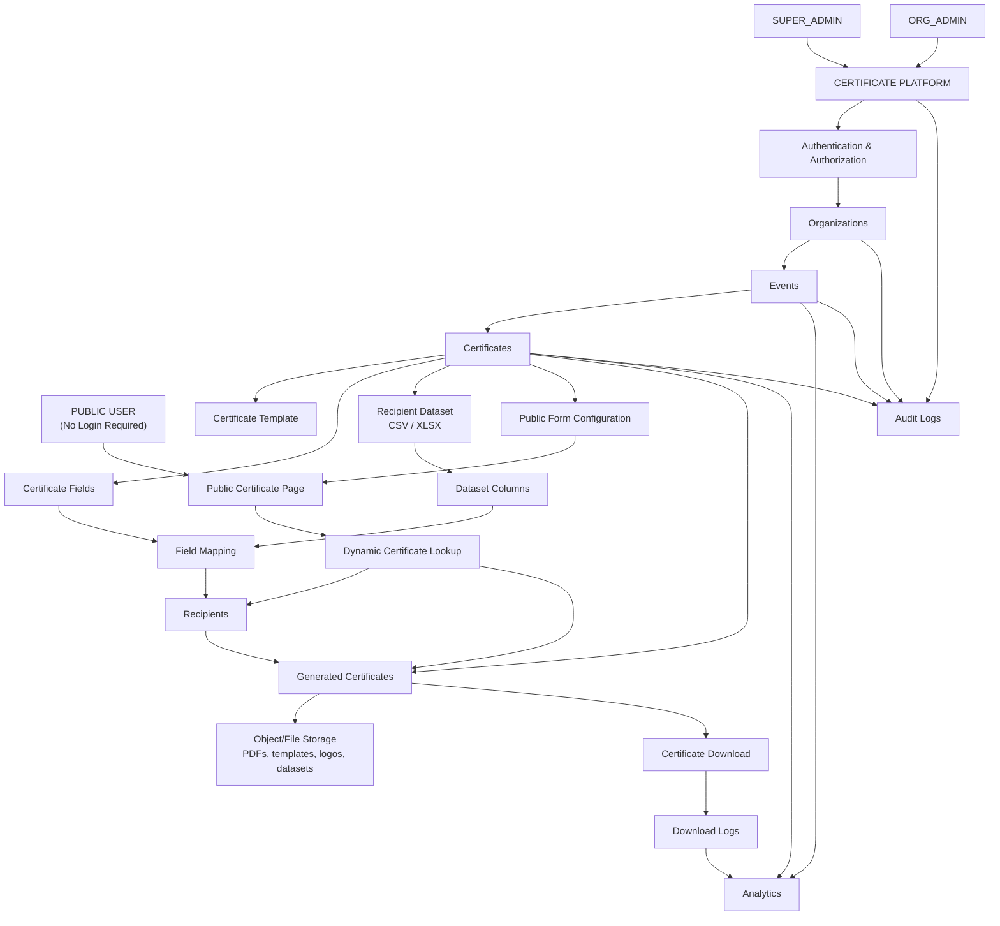

---

## 4. Organization Hierarchy

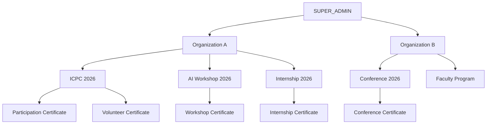

---

## 5. Main Organizer Workflow

```mermaid
flowchart LR

    A["Create Event"] --> B["Create Certificate"]
    B --> C["Configure Template"]
    C --> D["Upload CSV/XLSX"]
    D --> E["Detect Columns"]
    E --> F["Map Columns"]
    F --> G["Select Mandatory<br/>Public Form Fields"]
    G --> H["Preview Certificate"]
    H --> I["Validate"]
    I --> J["Publish"]
    J --> K["Generate Certificates"]
    K --> L["Store PDFs"]
    L --> M["Generate Public URL"]
```

---

## 6. Certificate Configuration

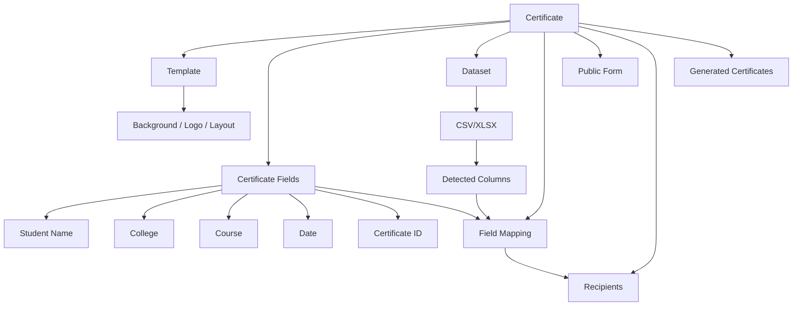

---

## 7. Dynamic Public Form

The public form must not be hardcoded for individual events.

The organizer selects which available fields are required.

For example:

```text
Available columns:

Name
Email
College
Course
Registration ID
Phone

Selected required fields:

Email
Registration ID
```

The application then automatically renders:

```text
ICPC 2026

Email *
[________________________]

Registration ID *
[________________________]

[ Find Certificate ]
```

Another event can have a different configuration without any code changes.

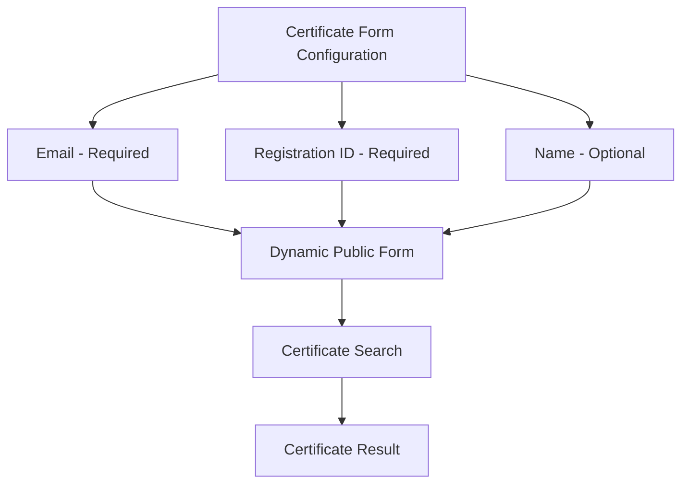

---

## 8. Certificate Generation and Download

Certificates should preferably be generated once and stored.

Do not regenerate a PDF on every download.

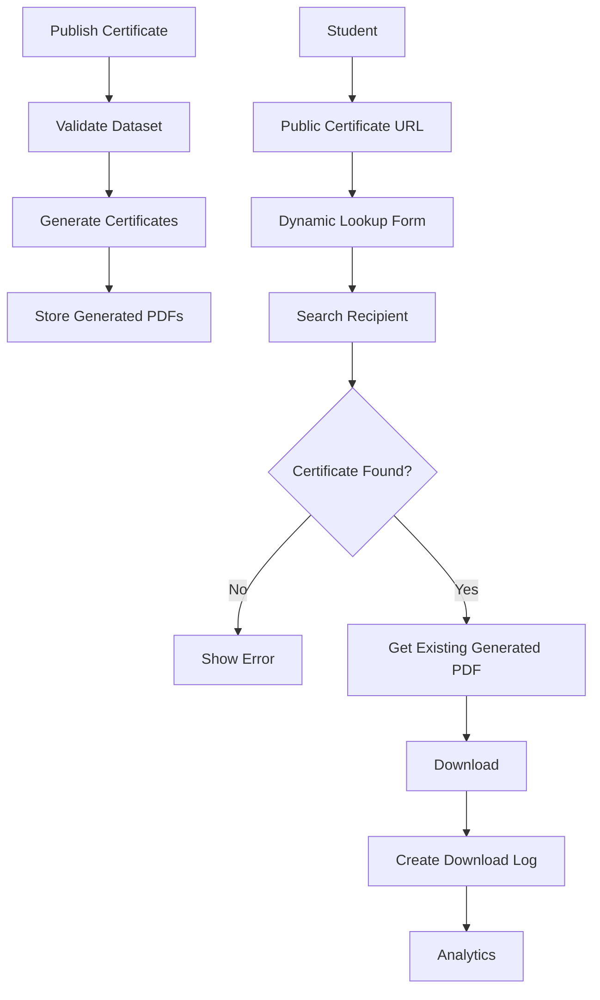

---

## 9. Database ER Diagram

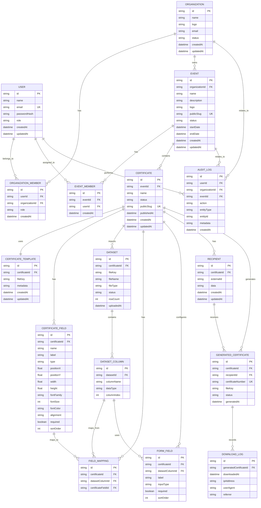

> **Note:** `EVENT_MEMBER` is optional if you are keeping only `SUPER_ADMIN` and `ORG_ADMIN`. It can be removed initially. It is shown as an extension point if event-level assignment is needed later.

---

## 10. Application Architecture

A modular monolith is recommended for the first version.

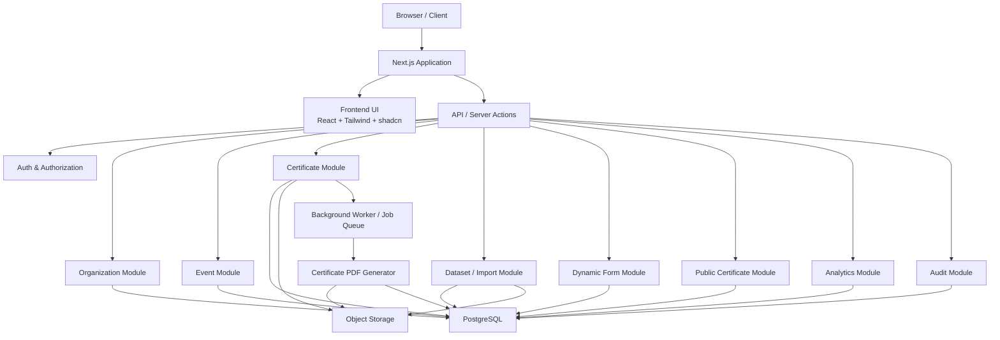

---

## 11. File / Template Handling

Generated certificate PDFs do **not** need permanent storage.

The user receives the generated PDF directly as an HTTP download.

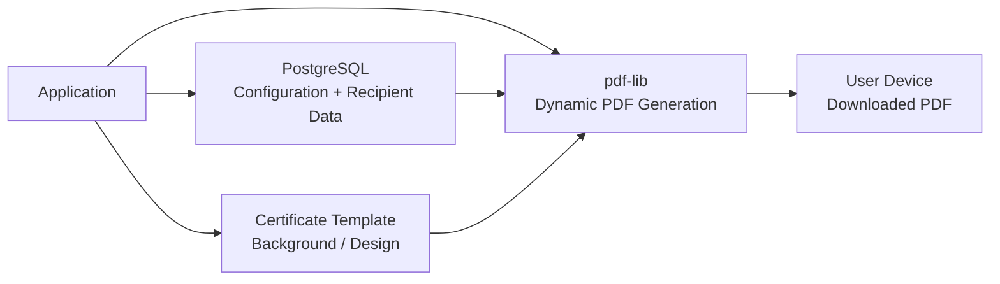

The database stores certificate configuration, field positions, mappings, recipient data, and references to reusable template assets.

The certificate generation flow is:

```text
User opens public certificate page
        ↓
User fills dynamically generated form
        ↓
Backend validates the submitted fields
        ↓
Find matching recipient record
        ↓
If no match → show error
        ↓
If match → load certificate configuration
        ↓
Load template/background asset
        ↓
Use pdf-lib to generate the certificate
        ↓
Return PDF response
        ↓
Browser downloads PDF to user's device
```

### Important

Do **not** store every generated PDF permanently unless a future requirement makes this necessary.

This keeps the initial architecture simpler and avoids unnecessary storage costs.

For high traffic, PDF generation can later be optimized using caching, controlled concurrency, or background processing without changing the public workflow.

## 12. Admin Architecture

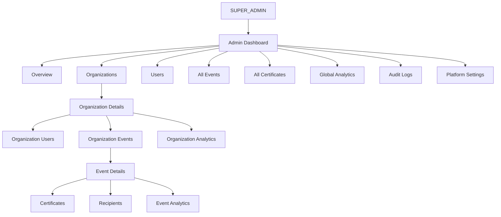

---

## 13. Organization Admin Architecture

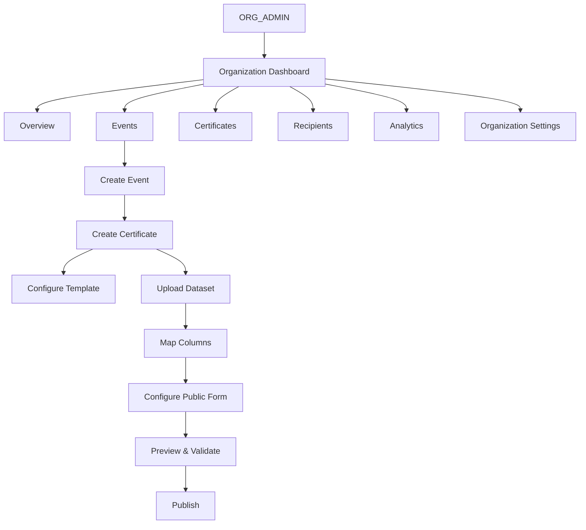

---

## 14. Public User Architecture

No account is required.

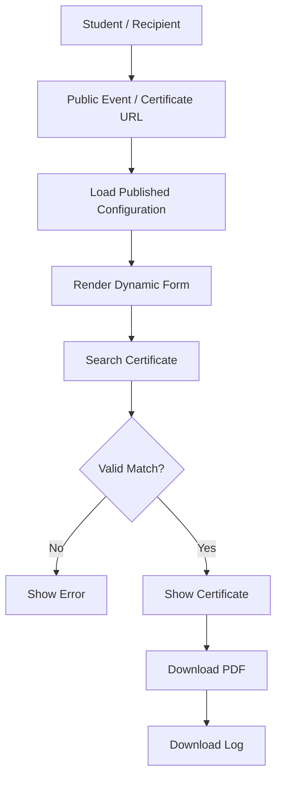

---

## 15. Publishing Lifecycle

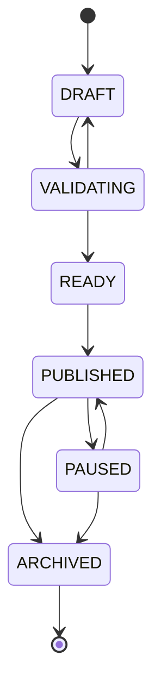

Recommended states:

- `DRAFT`
- `VALIDATING`
- `READY`
- `PUBLISHED`
- `PAUSED`
- `ARCHIVED`

---

## 16. Analytics Architecture

Use logs as the source of truth.

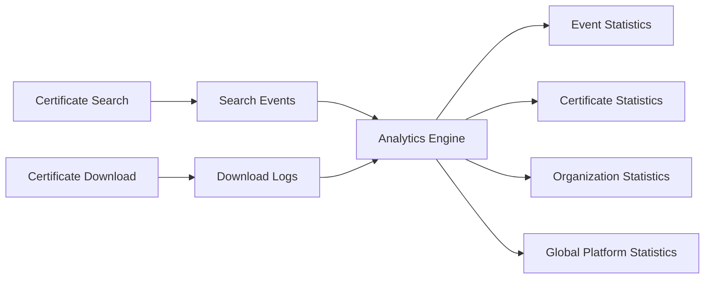

Metrics can include:

- Total searches
- Successful searches
- Failed searches
- Total generated certificates
- Total downloads
- Unique downloads
- Downloads per day
- Downloads by date range
- Certificate-specific statistics
- Event-specific statistics
- Organization-specific statistics

---

## 17. Performance / Scaling Principle

The default workflow generates a certificate only after a valid recipient lookup.

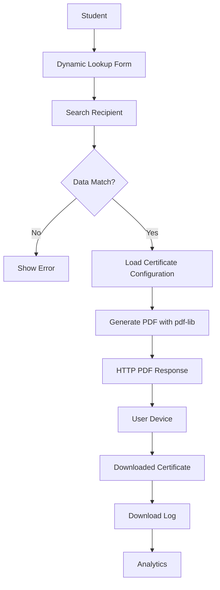

This means:

- No permanent generated-PDF storage is required.
- No PDF is generated when the lookup fails.
- The PDF is generated only after a valid match.
- The generated PDF is sent directly to the user's browser/device.
- The download event is recorded for analytics.

For large datasets or high simultaneous traffic, use controlled PDF generation/concurrency. Do not introduce a complex distributed architecture unless actual load requires it.

## 18. Core API Structure

The API should be generic and resource-based.

```text
/api/auth

/api/organizations
/api/organizations/:id

/api/events
/api/events/:id

/api/certificates
/api/certificates/:id

/api/certificates/:id/template
/api/certificates/:id/fields

/api/certificates/:id/datasets
/api/certificates/:id/mappings
/api/certificates/:id/form

/api/certificates/:id/recipients
/api/certificates/:id/publish

/api/public/:slug
/api/public/:slug/search
/api/public/:slug/download

/api/analytics
/api/analytics/:certificateId
```

Do NOT create certificate-specific APIs such as:

```text
/api/icpc-certificate
/api/workshop-certificate
/api/internship-certificate
```

---

## 19. Project Structure

A possible project organization:

```text
src/
│
├── auth/
│
├── admin/
│
├── organizations/
│
├── events/
│
├── certificates/
│   ├── designer/
│   ├── fields/
│   ├── templates/
│   └── generation/
│
├── datasets/
│   ├── csv/
│   ├── xlsx/
│   └── mapping/
│
├── recipients/
│
├── public/
│   ├── lookup/
│   └── certificate/
│
├── analytics/
│
├── storage/
│
└── audit/
```

---

## 20. Most Important Design Rule

Never create certificate-specific code when the difference can be represented as configuration.

Bad:

```text
if event === "ICPC":
    show ICPC form

if event === "Workshop":
    show Workshop form

if event === "Internship":
    show Internship form
```

Good:

```text
Load certificate.formFields
        ↓
Render fields dynamically
```

Similarly:

```text
certificate.fields
        ↓
Render certificate dynamically
```

and:

```text
certificate.fieldMappings
        ↓
Populate recipient data
```

---

## 21. Complete Business Flow

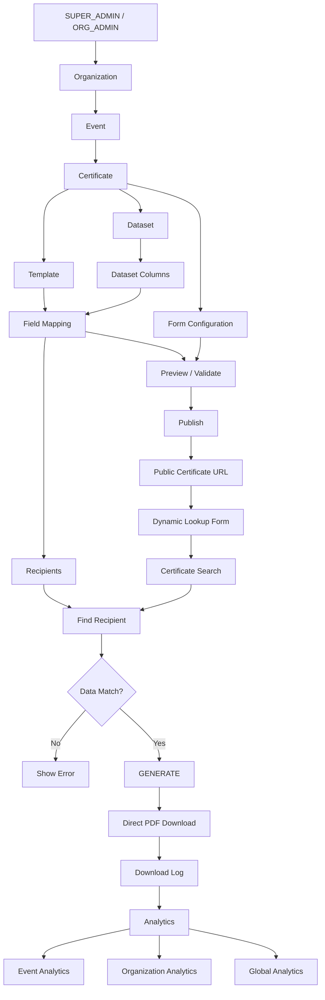

---

## 22. PDF Generation

Use **pdf-lib** for dynamic certificate generation.

The certificate template/design should be treated as reusable configuration/assets, while recipient-specific values are inserted at request time.

Example conceptual flow:

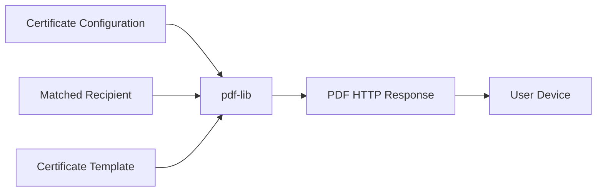

Example dynamic values:

```text
{{student_name}}
{{college}}
{{course}}
{{event_name}}
{{certificate_id}}
{{date}}
```

The backend resolves these values from the mapped recipient record and writes them into the PDF using `pdf-lib`.

Do not expose the full recipient dataset to the browser. The browser should submit the configured lookup values to the backend, and the backend should perform the matching.

## 23. Implementation Strategy

Do not blindly delete the existing application.

First:

1. Audit the existing application.
2. Identify reusable certificate/PDF generation logic.
3. Identify reusable analytics/download tracking.
4. Identify authentication and storage logic.
5. Design and migrate the new database schema.
6. Implement organizations and roles.
7. Implement events.
8. Implement dynamic certificates.
9. Implement CSV/XLSX import.
10. Implement field mapping.
11. Implement dynamic public forms.
12. Implement preview/validation.
13. Implement publishing.
14. Connect certificate generation.
15. Connect existing analytics.
16. Implement admin dashboard.
17. Test with multiple completely different certificate types.

The final system should satisfy this rule:

> **Creating a new certificate must require configuration, not writing new certificate-specific code.**
